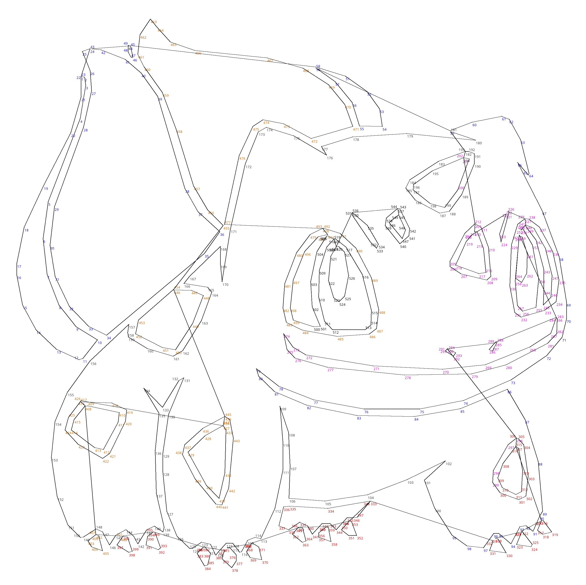

# dot-to-dot
Original repository creator:
https://github.com/ostenbom/dot-to-dot.git

I have upgraded so you can use it with Python3
Solved an issue where the generated image would come with lines attached to it.

python3 -m venv venv
source venv/bin/activate or on windows C:\> venv\Scripts\activate.bat
pip install -r requirements.txt
python3 Main.py ./testimages/Bulbasaur.png true

## Output
|||

there will be also a PDF without lines under intermediate/notclean.pdf
